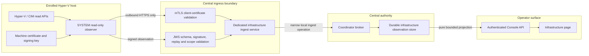

# Remote infrastructure observation contract

Status: target contract for the first SPECTRE Hyper-V laboratory and every
later enrolled host. The first release is deliberately observation-only. It
does not grant remote power, console, checkpoint, disk, network, or guest
control.

## Product boundary

The Console currently calls a local process or container a **Server**. A
Hyper-V host and its virtual machines are a different domain with different
identity, failure, security, and lifecycle semantics. They therefore appear on
their own **Infrastructure** destination and never as fabricated local Server
rows.

The first enrolled site is one Windows Server 2022 Hyper-V host. Six
`SPECTRE-LAB-*` virtual machines share that host, storage, power, management
plane, and virtual switch. The UI must call it a single-host laboratory and
must not describe six VMs as six independent failure domains or as production
HA.

## Trust and data flow



The observer initiates every network connection. No inbound Windows
management port is opened for routine reporting. The dedicated ingest service
is a separate supervised availability and credential boundary from the public
Console listener. Browser traffic never negotiates an infrastructure client
certificate.

Transport authentication and message authentication are independent:

- TLS requires a private infrastructure CA, Client Authentication EKU, valid
  chain, validity window, revocation policy, and an exact enrolled certificate
  fingerprint. On every accepted report, the dedicated ingress derives the
  SHA-256 fingerprint from the actual leaf DER, validates the leaf at the
  current time, and fail closed unless its chain terminates at the exact
  infrastructure trust anchor, its EKU permits client authentication, and a
  signed, issuer-matching, currently fresh CRL proves it is not revoked. The
  v1 implementation rebuilds its TLS 1.3 context from that authenticated CRL
  for every TCP connection, permits exactly one request on that connection,
  then closes it. The actual leaf `notBefore`/`notAfter` values must exactly
  match the enrolled generation window and may span no more than 30 days. A
  soft-fail or unavailable CRL, future or stale `lastUpdate`, missing or
  expired `nextUpdate`, caller-supplied certificate fact, or retained
  connection cannot produce `mtls_verified: true`.
- The Windows client authenticates the dedicated ingress server with exactly
  one `spectre.classified.guru` DNS SAN, the pinned server trust root and
  pinned leaf SPKI. Because the reviewed Windows transport does not claim an
  online server-certificate revocation check, those pins are still
  insufficient by themselves: every server leaf is an explicit positive
  generation, pinned by DER SHA-256 and exact validity seconds, valid for at
  most seven days, and rebound by the short-lived central readiness receipt.
  Wildcards, Common Name fallback, extra SAN identities, an unreviewed
  generation or a leaf/config mismatch fail closed.
- The observation is a compact JWS signed by the enrolled machine-held key.
  The closed canonical protected header binds exact `PS256`, content type, key
  identifier, leaf fingerprint, certificate generation, and SPKI digest; the
  signed payload binds the observation schema. Each certificate generation
  stores canonical DER
  SubjectPublicKeyInfo, its SHA-256 digest, and the human-readable key ID.
  Enrollment accepts only canonical `rsaEncryption` SPKI that round-trips
  byte-for-byte, uses an odd 3,072–8,192-bit RSA modulus, and has public
  exponent exactly 65,537. The SPKI digest is globally unique across agents
  and generations: every new certificate generation requires a newly
  generated JWS key. Cert-only renewal with the same JWS key is outside v1 and
  requires a separately modeled lifecycle rather than silent key reuse. The
  Windows observer target is a non-exportable
  machine-scoped CNG RSA-3072 key. TLS termination alone is not evidence of
  message origin.
- After JWS verification, ingress rejects duplicate JSON keys, floats,
  non-finite values, non-NFC strings, and any payload bytes that are not the
  exact canonical UTF-8 serialization: object keys sorted, `,`/`:` separators,
  and Unicode emitted directly rather than through alternate escapes. Address
  arrays use canonical IP text and sort by that text; VM arrays sort by VM
  UUID. Ingress computes `canonical_payload_sha256` over those exact bytes.
  The observer payload contains no self-referential digest.
- The central broker rechecks immutable agent, host, certificate generation,
  exact PS256/SPKI digest, monotonic sequence, boot identifier, observation
  identifier, capture time, assigned resource scope, and the independently
  reserialized canonical payload digest before one transaction advances
  current state. A matching key ID with different key bytes is rejected.
- One generation has a maximum 30-day validity window. A newer generation may
  overlap any unrevoked generation of the same agent by at most 72 hours.
  New generations are exact monotonic successors and always use a new JWS key;
  older generations remain independently valid until their own expiry or
  explicit generation-specific revocation. The 30-day/72-hour v1 balance
  limits key exposure without creating weekly manual-renewal outages while
  issuance is still root-only and offline. A later, verified automatic
  rotation design may reduce the maximum to seven days through a new recorded
  decision. Revoked, unknown, expired, replayed, out-of-order, future-dated,
  oversized, or schema-unknown reports fail closed.

The observer private key is generated on the Hyper-V host and is never copied
through a prompt, Git, Console response, log, evidence bundle, or SSH command.
The central CA private key is not stored on the Hyper-V host or in the Console
source tree.

Before calling the broker, ingress publishes the exact compact JWS bytes to a
private service-owned content-addressed staging store. The broker accepts no
caller path: it derives the only permitted path from the supplied SHA-256,
reopens the mode-0400 regular file without following links, proves owner,
size, link count, device, inode, modification time and digest, then publishes
and reopens its own root-owned content-addressed copy. Only
`sha256:<digest>`, byte count and the digest enter the authority transaction.
An accepted or rejected broker outcome is evidence-bound only after that
broker copy exists. A report rejected before broker publication may leave a
safe unreferenced staging object; a report rejected after publication may
leave a safe unreferenced broker object. Neither orphan is current evidence,
and deletion requires a separately verified retention/garbage-collection
operation.

## Immutable identities

Names and IP addresses are presentation data, not join keys.

| Object | Immutable identity | Mutable presentation |
| --- | --- | --- |
| Security cell | random UUID | cell name, region, classification label |
| Physical host | random UUID enrolled once | hostname, management address |
| Observer agent | random UUID plus certificate generation | version, last contact |
| Hyper-V VM | Hyper-V `VMId` GUID scoped to host UUID | name, role, IP addresses |
| Observation | UUID plus agent boot UUID and monotonic sequence | capture metadata |

A reinstall or certificate rotation retains the host UUID only through an
explicit owner-reviewed recovery/enrollment operation. A VM recreated with the
same name is a new VM because its Hyper-V GUID changed.

## Versioned observation

The v1 signed payload is closed and bounded:

```json
{
  "schema": "spectre.infrastructure.observation.v1",
  "observation_id": "uuid",
  "cell_id": "uuid",
  "host_id": "uuid",
  "agent_id": "uuid",
  "agent_boot_id": "uuid",
  "sequence": 1,
  "captured_at": "second-resolution RFC3339 UTC",
  "roster_complete": true,
  "roster_error_code": null,
  "host": {
    "hostname": "string",
    "platform": "windows-hyperv",
    "platform_version": "string",
    "management_addresses": ["ip"],
    "logical_cpu": 40,
    "physical_memory_bytes": 137371844608,
    "uptime_seconds": 1234
  },
  "virtual_machines": [
    {
      "vm_id": "Hyper-V GUID",
      "name": "string",
      "role": "enrollment-owned string or null",
      "state": "running|off|paused|saved|starting|stopping|unknown",
      "generation": 2,
      "vcpu": 4,
      "startup_memory_bytes": 8589934592,
      "assigned_memory_bytes": 0,
      "ip_addresses": ["ip"],
      "heartbeat": "ok|degraded|unknown|not-running",
      "automatic_checkpoints": false,
      "replication": "disabled|enabled|unknown"
    }
  ],
  "evidence": {
    "observer_version": "semver",
    "scope_sha256": "64 lowercase hex"
  }
}
```

`roster_complete` is mandatory and never inferred from array length. A
complete report requires `roster_error_code: null`; a partial report requires
one bounded typed error code. The production validator bounds the canonical
payload to 512 KiB, one host to 1,024 VMs, management addresses to 16, VM
addresses to 32, integer values to SQLite's positive 64-bit range, and capture
time to five minutes of future skew. The broker's outer envelope is separately
bounded to 2 MiB. The `role` value comes only from the centrally approved
enrollment scope; the observer cannot self-assign a privileged role by naming
a VM.

The dedicated ingress submits the three-member outer object structurally
excerpted below to the broker; the real observation member is the complete
canonical object shown above. It never submits certificate material, a
database path, SQL, a filesystem path, or a command:

```json
{
  "transport": {
    "mtls_verified": true,
    "jws_verified": true,
    "certificate_fingerprint_sha256": "64 lowercase hex",
    "certificate_generation": 1,
    "jws_key_id": "bounded enrolled key id",
    "jws_algorithm": "PS256",
    "jws_spki_sha256": "64 lowercase hex",
    "canonical_payload_sha256": "64 lowercase hex"
  },
  "observation": {
    "schema": "spectre.infrastructure.observation.v1"
  },
  "artifact": {
    "schema": "spectre.infrastructure.signed-envelope-artifact.v1",
    "sha256": "64 lowercase hex",
    "size_bytes": 12345
  }
}
```

`mtls_verified` is one aggregate assertion from that separately supervised
ingress. The source contains the network ingress and failure-shaped unit
coverage, but no unit fixture is evidence that the service was deployed or
that a real agent traversed the live TLS listener.

The broker normalizes the decoded observation, serializes it by the same
canonical rules, and requires an exact digest match. Thus an
observer-supplied value is never accepted as digest verification.

## Narrow broker operations

Remote infrastructure deliberately does not reuse repository enrollment.
Root/admin provisioning binds an exact local UID and account to only the
required fixed-scope operations, with a required expiry:

| Operation | Fixed project | Fixed resource | Purpose |
| --- | --- | --- | --- |
| `infrastructure.verification_context` | `infrastructure` | `verification-context` | exact fingerprint+generation public-key lookup; never list or search |
| `infrastructure.ingest` | `infrastructure` | `observation-ingest` | submit one verified report |
| `infrastructure.read` | `infrastructure` | `observation-read` | read the bounded projection |

All require `repository_generation: 0`. The ingress UID receives verification
context plus ingest; the Console read bridge receives only read. The exact
verification-context request contains only certificate SHA-256 fingerprint and
generation and returns public PS256/SPKI, agent/host/cell/scope, validity,
revocation, and enrollment-enabled facts. It never enumerates identities, and
ingest still rechecks the same authority row transactionally.

The dedicated public-ingress service ACL cannot grant repository, runtime,
lifecycle, Docker, database, port, host-observe, read, or remote-mutation
authority. Ingress enrollment rejects a UID with any broader broker authority;
ingest and verification-context authorization repeat that isolation proof on
every request, so later ACL drift fails closed. Repository enrollment
reciprocally rejects a UID while an ingress or verification-context grant is
enabled. The current authenticated Console/API UID may retain its broader
repository authority and one exact expiring, non-mutating
`infrastructure.read` grant for the laboratory integration. Production may
split that read bridge onto a dedicated reader UID; no claim is made that the
current Console UID has only infrastructure-read authority.

Infrastructure enrollment and certificate lifecycle have no broker socket,
Console, or public HTTP administration route. The only operating surface is
the offline local command:

```text
/usr/bin/python3 -I -B scripts/run_verified_authority.py -- \
  skills/codex-dev-coordinator/scripts/dev_coordinator.py \
  broker infrastructure-admin \
  --database /var/lib/devcoordinator/coordinator.sqlite3 \
  --request-file /root/private-transaction/infrastructure-request.json
```

It requires effective UID 0, an already activated root-owned schema-v14
database and a stable root-owned request file, holds the exclusive broker
service lock, and accepts one closed
`spectre.infrastructure.admin.v1` request for cell, host plus exact approved VM
GUID scope, agent, certificate generation, or exact certificate revocation.
It accepts public SPKI only—never private keys or secrets. The enrollment
mutation and immutable receipt commit in one transaction; the receipt binds
request ID, canonical request and result digests, operator UID, authority
schema, action, and timestamp. Exact request replay returns that receipt
without advancing state; reuse of the request ID with different material fails
as a conflict.

## Durable authority model

The Coordinator remains the only writable authority used by the Console.
Remote infrastructure enrollment and observations require additive,
transactional tables owned by that broker:

- security cells and enrolled physical hosts;
- observer agents and immutable PS256/SPKI certificate
  generations/revocations;
- immutable root-administration request/result receipts;
- accepted observation headers and replay state;
- current VM observations keyed by `(host_id, vm_id)`;
- immutable acceptance/rejection audit events.

One accepted report commits the agent sequence, host snapshot, current VM
updates, and audit event together. A complete roster makes absence meaningful
and removes omitted VMs from the current projection. A partial discovery
updates only VMs it actually observed and preserves all previously current
rows. Every rejected report retains an immutable bounded audit event and never
replaces the last accepted snapshot.

The first laboratory may use the existing broker SQLite authority, but this is
not the global control-plane database or a million-user capacity claim.
Production multi-site promotion requires its own PostgreSQL HA, backup,
restore, retention, failover, and regional-cell qualification rather than
sharing the SPECTRE operational database implicitly.

## Console projection

The owner-only `#/servers` destination places the real Hyper-V collection
before local server details, with loading, retained-snapshot error, empty and
populated states. `#/infrastructure` is the collection-first detailed view:

1. enrolled hosts, or an honest loading/error/empty state, appear in the first
   viewport;
2. each host row shows cell, platform, contact freshness, capture freshness,
   report verification, current and centrally approved VM counts, bounded
   GUID-keyed missing-approved identities, capacity, and the explicit
   failure-domain label;
3. expanding a host shows the VM roster keyed by VM GUID, with state, role,
   resource allocation, heartbeat, and observed addresses;
4. `last contact`, `last captured`, `last accepted`, `signature verified`, and
   `evidence available` remain separate fields. `last contact` means the last
   transport-verified mTLS/JWS/enrollment contact accepted far enough to bind
   the enrolled agent; it is not generic network reachability. A canonical
   payload digest and normalized current rows do not by themselves make
   `evidence available`: that flag becomes true only when the broker has
   retained and rebound the exact verified signed-envelope artifact;
5. the observer cadence is 60 seconds. Contact, capture, and acceptance remain
   `Fresh` until 179 seconds of age, become `Stale` at exactly 180 seconds
   (three missed observations), and remain `Never` before the first matching
   event. Stale data remains visible and is never relabelled offline; freshness
   is not reachability and only a future explicit terminal report may prove an
   offline classification;
6. no Start, Stop, Restart, console, disk, checkpoint, or network action is
   rendered in v1.

The Console server rejects a non-owner/non-access-admin before cursor parsing
or any Coordinator read. Navigation hiding is only a secondary presentation
guard. Disabled cell or host enrollment is shown as administratively inactive
even when retained telemetry is fresh. Production requires a separate
principal-to-cell/classification/clearance policy and non-interference proof;
the laboratory owner gate is not that policy.

The page polls only while visible and consumes a bounded, immutable-ID-sorted
projection. Broker reads expose at most 100 hosts per page, 256 VMs per host,
and 20 recent rejection incidents per host, with exact host-ID pagination.
The canonical UTF-8 projection is also capped at 12 MiB, below the broker's
16 MiB result-frame ceiling; if the next host would cross the byte bound, the
page ends before that host and returns its exact continuation cursor. A
rejected report never replaces the last accepted snapshot; the operator sees
the retained snapshot plus a separate ingestion incident.

## Required gates

Source readiness requires:

- strict payload/JWS/TLS/enrollment validation and realistic must-reject tests;
- concurrent monotonic-sequence and duplicate-id replay tests;
- atomic complete-roster replacement and partial-discovery preservation tests;
- v4-to-v14 and v12-to-v14 migration regressions that retain representative
  legacy rows and create the additive infrastructure authority;
- v13-to-v14 migration proof: an empty v13 certificate table upgrades
  additively, while any v13 certificate row without recoverable SPKI blocks
  activation and requires audited reenrollment rather than invented key data;
- certificate issue, exact 30-day/30-day-plus-one-second and
  72-hour/72-hour-plus-one-second boundaries, expiry, central revocation,
  global cross-agent/cross-generation key-reuse rejection, and wrong
  fingerprint/key-material tests;
- a Windows fixture proving the observer uses read-only Hyper-V/CIM commands;
- authenticated API tests and wide/narrow Infrastructure UI verification;
- no remote mutation endpoint or control in the v1 route inventory.

Network-ingress **live** readiness remains a separate active gate even though
the source service and failure-shaped tests now exist: install the pinned
runtime and dedicated systemd unit, then exercise a real private-CA chain and
client leaf through the deployed TLS stack. Reject wrong trust anchor,
missing/wrong Client Authentication EKU, not-yet-valid and expired leaves,
missing/future/stale/expired/wrong-issuer CRLs, a revoked serial, changed leaf
fingerprint, wrong PS256 signature/key, HTTP framing ambiguity, overload and
restart/replay. Those tests must observe ingress refusal and absence of a
broker ingest, not merely construct `mtls_verified: false` in a unit fixture.

Deployment activation is a separate offline gate. The live authority was
observed at schema v4. The source maintenance workflow now explicitly targets
v4-to-v14, and read-only readiness verification has passed against exact
service-owner, UID-0 and UID-1000 clones with SQLite integrity, foreign-key,
Coordinator semantic, representative legacy-read and empty infrastructure
projection checks. After both writer-free checkpoints, that workflow runs the
standalone guarded upgrader separately against the root-owned service
authority and the Console-UID-owned client journal, retaining a distinct
create-new mode-0400 receipt for each database. Only after both receipted
schema upgrades does protected-profile migration run as a backfill followed
by an idempotency pass. Those source and clone results are necessary but are
not a live cutover. Before production restart, the approved maintenance
transaction must still capture the exact live databases and verified rollback
artifacts, execute both upgrades, repeat readiness on both quiesced candidates,
activate the exact v14 authority, and prove broker/API/Console convergence or
roll back.

Ingress deployment uses the separately documented
`docs/operations/remote-infrastructure-ingress.md` procedure. Its fixed
non-root service UID receives only
`infrastructure.verification_context` plus `infrastructure.ingest` through a
root-only, broker-offline, immutable-receipt request valid for at most 30
days. It can be disabled immediately with a separate receipted request.
The Console/API operating-system identity separately receives only
`infrastructure.read`, also through a root-only, broker-offline, expiring
receipt. Central readiness binds both live grants and fails if either is
missing, expired, broadened, revoked, or no longer matches its retained
receipt.

Live laboratory readiness additionally requires:

- host-generated protected private key and owner-approved enrollment receipt;
- exact observer source/artifact hashes and protected scheduled-task identity;
- one accepted report from `10.0.10.211` containing the six approved VM GUIDs;
- stale/contact recovery, reboot/sequence recovery, invalid-signature, replay,
  roster-loss, and ingress-restart exercises;
- public Console proof that the lab appears as one host/six VMs and explicitly
  says that loss of this host stops the whole laboratory.

Production readiness is a separate gate: independent hosts/sites, central
control-plane PostgreSQL HA and restore, certificate/revocation operations,
retention, monitoring, denial-of-service limits, disaster recovery, and
measured ingestion/UI behavior at the approved fleet size.
